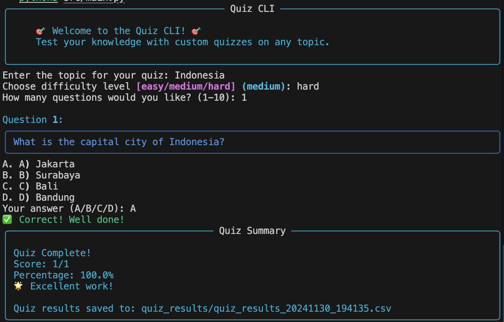

# Quiz CLI Application

An interactive command-line quiz application that generates questions using OpenAI's API.



## Features

- 🎯 Dynamic quiz generation using OpenAI
- 🎨 Beautiful CLI interface
- 📊 Instant scoring and feedback
- 🔄 Multiple difficulty levels

## Setup

1. Clone the repository
2. Create a virtual environment: `python -m venv .venv`
3. Activate the virtual environment:
   - Windows: `.\.venv\Scripts\activate`
   - Unix/MacOS: `source .venv/bin/activate`
4. Install dependencies: `pip install -r requirements.txt`
5. Copy `.env.example` to `.env` and add your OpenAI API key

## Usage

Run the application:

```bash
python src/main.py
```

Here's how it looks in action:

## Testing

Run tests using pytest:

```bash
pytest tests/
```

## Author

Created by DarmaCoder

## Connect With Me

<p align="left">
  <a href="https://www.instagram.com/greatwynma_ig/">
    
  </a>
</p>

## License & Copyright

© 2024 DarmaCoder. All rights reserved.

This project is licensed under the MIT License - see the [LICENSE](LICENSE) file for details.

### Terms of Use

- This code is provided for educational and personal use.
- Commercial use requires explicit permission from the author.
- When sharing or redistributing, credit must be given to the original author.
- Modifications are allowed for personal use but must maintain original copyright notices.

---

<p align="center">
  
  <br>
  Made with ❤️ by DarmaCoder
</p>
